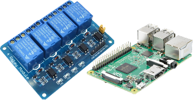

# Watering System with a Raspberry PI Model 3B an electrical relay

This project was born from the need to water our garden during the hot summer while we were gone.
I was going to leave for a month but our garden was flourishing and still needed water and care even without us around.
The idea was to have a dashboard to control our watering system remotely while we were gone.

### FEATURES

- Client-side dashboard to control the watering system
  - Visible logs of when the watering system is turned on or off in the backyard, front yard or both with a timestamp
  - Chart with the temperature of the CPU of the Raspberry PI (I initially wanted to get a temperature sensor, but didn't get to that yet)
- Login mechanism to have access to the dashboard
- Back-end server to expose API endpoints for the client side
- Cron jobs to automate the watering for a set amount of time every day (configurable settings)

### TECH

* [ReactJS](https://reactjs.org/) Responsible for the dashboard of our watering system
* [NodeJS](https://nodejs.org) Node.js is a JavaScript runtime built on Chrome's V8 JavaScript engine
* [Express](https://expressjs.com/) NodeJS framework easing the development of the back-end and API endpoints.
* [Python](https://www.python.org/) Responsible for the majority of scripts interfacing between the web server and the onboard GPIO pins

### HARDWARE

* 1 Raspberry PI - I'm using Model 3 B
* 1 Electrical Relay

